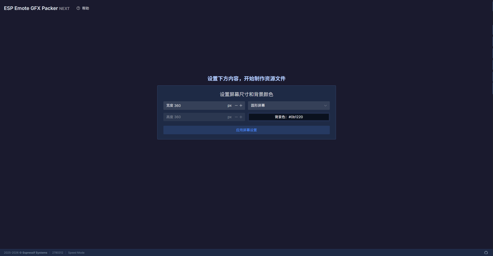
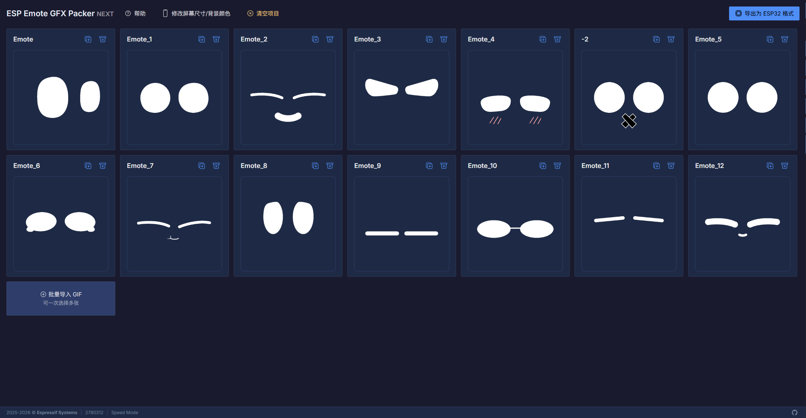

# Emote Gen GFX

ESP-IDF component that **mounts Emote Gen–style mmap asset packs** and drives **`gfx_anim`** playback (segment plans, immediate switch vs. handoff after the current plan).

> **Repository folder / local component id:** `esp_emote_gen_player` (use this name in `idf.py` `EXTRA_COMPONENT_DIRS` or `idf_component.yml` `path:` dependencies).

## What it does

- Loads a device-side **mmap / SPIFFS** image produced by the packer; mounts animation assets and wires **`gfx_anim`** segment plans.
- **`emote_gen_player_init` / `deinit`**: gfx runtime, one display, internal animation object.
- **`emote_gen_player_mount_assets`**: load pack from **partition** or **filesystem path** (optional mmap).
- **Animation switching**
  - **`emote_gen_player_anim_now` / `_name`**: cut to the target clip immediately.
  - **`emote_gen_player_anim_fade` / `_name`**: drain the current segment plan (`gfx_anim_play_left_to_tail`), then switch — **do not call these from the gfx touch timer callback while the render lock is held**; defer to another task (see `test_apps`).

## Pack tool (host): ESP Emote GFX Packer NEXT

Author packs in the browser and **export the `*.bin`** you flash on the device:

**[ESP Emote GFX Packer NEXT (dev)](https://emote-gfx-gen-tool-dev.pages.dev/)**

### 1. Screen setup

Configure the target **width / height** (px), **rectangular** canvas if needed, and **background color**, then apply. This matches the display you will run on.



### 2. Load source animation

Import your **GIF** (or other supported sources per the editor). Adjust timing / layout as needed; use **Help** in the app for details.



### 3. Export

Use the packer’s **export / download** action to get the **mmap-ready binary** for **`esp_mmap_assets`**. The **`test_apps/`** project downloads a reference blob from **`https://dl.espressif.com/AE/emote_assets.bin`** at configure time (see `test_apps/main/CMakeLists.txt`); replace the URL or use a local file if you build your own pack.

## Dependencies

- **`esp_emote_gfx_main`** (esp_emote_gfx) — display, anim, touch integration.
- **`esp_mmap_assets`** — mmap pack layout.
- **`json`** (cJSON) — parses pack metadata **inside** the mounted image.

## Usage

```yaml
# idf_component.yml
dependencies:
  esp_emote_gen_player:
    path: ../path/to/esp_emote_gen_player
```

```c
#include "emote_gen_player.h"

emote_gen_player_handle_t player = emote_gen_player_init(&cfg);
// …

emote_gen_player_data_t data = {
    .type = EMOTE_GEN_PLAYER_SOURCE_PARTITION,
    .source.partition_label = "emote_gen",
    .flags.mmap_enable = 1,
};

ESP_ERROR_CHECK(emote_gen_player_mount_assets(player, &data));
ESP_ERROR_CHECK(emote_gen_player_anim_now_name(player, "idle"));
```

## Tests

- **`esp_emote_gfx_main`**: `test_anim_emote_gen` can depend on this component for the same asset layout.
- **This repo — `test_apps/`**: standalone `idf.py` project (board init, touch-safe animation switching). See **`test_apps/README.md`**.
