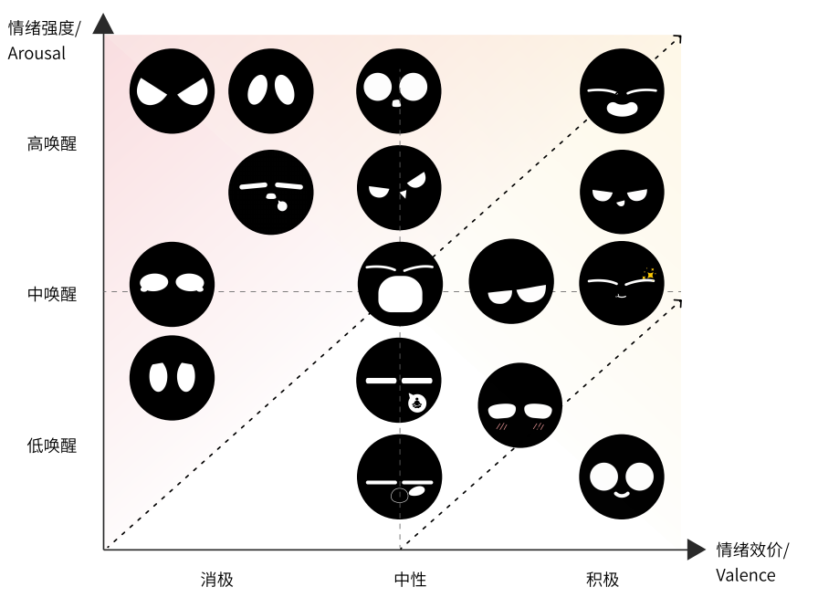

# ESP Emote Gen Player

<p align="center">
  
</p>

**Emotion design specification · 表情设计规范**

The matrix above is the **current taxonomy** for mapping emotional states (valence × arousal) to emote asset categories. Authoring, naming, and export should follow the official guidelines in the PDFs below (Simplified Chinese).

上图情绪矩阵为当前 **效价 × 唤醒度** 与表情资产类别的对应关系；制作、命名与导出请遵循下列 PDF 规范。

| Document |
| -------- |
| [表情动效系统规范文档.pdf](https://dl.espressif.com/AE/%E8%A1%A8%E6%83%85%E5%8A%A8%E6%95%88%E7%B3%BB%E7%BB%9F%E8%A7%84%E8%8C%83%E6%96%87%E6%A1%A3.pdf) |
| [表情设计规范.pdf](https://dl.espressif.com/AE/%E8%A1%A8%E6%83%85%E8%AE%BE%E8%AE%A1%E8%A7%84%E8%8C%83.pdf) |

**Languages / 语言:** [中文](#中文) · [English](#english)

---

## 中文

在设备上挂载 **打包工具导出的二进制资源包**，驱动 **`gfx_anim`** 播放（片段规划、立即切换与当前片段播完后再交接）。

页面顶部的 **情绪矩阵** 与 **两份规范 PDF** 定义分类与制作约束；导出资源时请与之对齐。

### 打包工具（主机端）：ESP Emote GFX Packer NEXT

> 浏览器端编辑工程，**导出 `*.bin`** 后烧录到设备；与目标屏的 **分辨率 / 画布** 一致即可。

**[ESP Emote GFX Packer NEXT (dev)](https://emote-gfx-gen-tool-dev.pages.dev/)**

#### 1. 屏幕设置

配置目标 **宽 / 高**（像素）、必要时 **矩形**画布与 **背景色** 并应用，使其与实际运行的显示屏一致。


#### 2. 载入源动画

导入 **GIF**（或其它编辑器支持的来源）；按需调整时间轴与布局，细节见应用内 **Help**。


#### 3. 导出

使用打包工具的 **导出 / 下载** 得到二进制；导出尺寸随编辑器中的 **屏幕设置**，源图层会 **自动缩放** 以适配画布。挂载后由 **本组件** 解析包内资源。

**`test_apps` 预编译示例包：** [`emote_assets.bin`](https://dl.espressif.com/AE/emote_assets.bin)

### 示例素材

> **GIF / Lottie** 等源文件合集，可导入上述打包工具再导出设备端包；由 **乐鑫 ESP 开源** 提供。

[**Emote Pack.zip**](https://dl.espressif.com/AE/Emote%20Pack.zip)

### 用法

将本仓库以本地路径加入工程依赖，初始化后挂载分区或路径上的资源包并切换动画：

```yaml
# idf_component.yml
dependencies:
  esp_emote_gen_player:
    path: ../path/to/esp_emote_gen_player
```

```c
#include "emote_gen_player.h"

emote_gen_player_handle_t player = emote_gen_player_init(&cfg);
// …

emote_gen_player_data_t data = {
    .type = EMOTE_GEN_PLAYER_SOURCE_PARTITION,
    .source.partition_label = "emote_gen",
    .flags.mmap_enable = 1,
};

ESP_ERROR_CHECK(emote_gen_player_mount_assets(player, &data));
ESP_ERROR_CHECK(emote_gen_player_anim_now_name(player, "idle"));
```

### 功能说明与测试

- 加载设备端由打包工具生成的 **二进制资源包**；挂载动画资源并接入 **`gfx_anim`** 的片段规划。
- **`emote_gen_player_init` / `deinit`**：gfx 运行时、单显示器、内部动画对象。
- **`emote_gen_player_mount_assets`**：从 **分区** 或 **文件系统路径** 加载资源包（可选 mmap）。
- **动画切换**
  - **`emote_gen_player_anim_now` / `_name`**：立即切到目标片段。
  - **`emote_gen_player_anim_fade` / `_name`**：先让当前片段规划播完（`gfx_anim_play_left_to_tail`），再切换 — **请勿在持有渲染锁的 gfx 触摸定时器回调里直接调用**；应放到其它任务中延迟执行（见 `test_apps`）。
- **本仓库 `test_apps/`**：独立 `idf.py` 工程（板级初始化、触摸安全的动画切换）。详见 **`test_apps/README.md`**。

---

## English

On device, **mounts packer-produced binary emote packs** and drives **`gfx_anim`** (segment plans, immediate switch vs. handoff after the current plan).

The **emotion matrix** and **two specification PDFs** at the top define taxonomy and authoring rules (Simplified Chinese); align exports with them.

### Pack tool (host): ESP Emote GFX Packer NEXT

> Author in the browser, **export `*.bin`**, then flash. Match the editor **canvas / resolution** to your target display.

**[ESP Emote GFX Packer NEXT (dev)](https://emote-gfx-gen-tool-dev.pages.dev/)**

#### 1. Screen setup

Configure **width / height** (px), optional **rectangular** canvas, and **background color**, then apply.


#### 2. Load source animation

Import **GIF** (or other supported sources). Adjust timing and layout; see in-app **Help** for details.


#### 3. Export

Use **Export / Download** to produce the binary. Export follows the **screen size** in the editor; layers are **rescaled** to fit. **This component** parses the mounted pack.

**Prebuilt sample for `test_apps`:** [`emote_assets.bin`](https://dl.espressif.com/AE/emote_assets.bin)

### Sample sources

> **GIF / Lottie** sources bundled for import into the packer above; **ESP open-source** from Espressif.

[**Emote Pack.zip**](https://dl.espressif.com/AE/Emote%20Pack.zip)

### Usage

Add this component via `idf_component.yml`, then mount a partition or filesystem path and switch clips:

```yaml
# idf_component.yml
dependencies:
  esp_emote_gen_player:
    path: ../path/to/esp_emote_gen_player
```

```c
#include "emote_gen_player.h"

emote_gen_player_handle_t player = emote_gen_player_init(&cfg);
// …

emote_gen_player_data_t data = {
    .type = EMOTE_GEN_PLAYER_SOURCE_PARTITION,
    .source.partition_label = "emote_gen",
    .flags.mmap_enable = 1,
};

ESP_ERROR_CHECK(emote_gen_player_mount_assets(player, &data));
ESP_ERROR_CHECK(emote_gen_player_anim_now_name(player, "idle"));
```

### What it does and tests

- Loads the packer-produced **binary asset pack**; wires **`gfx_anim`** segment plans.
- **`emote_gen_player_init` / `deinit`**: gfx runtime, one display, internal animation object.
- **`emote_gen_player_mount_assets`**: **partition** or **filesystem path** (optional mmap).
- **Animation switching**
  - **`emote_gen_player_anim_now` / `_name`**: cut to the target clip immediately.
  - **`emote_gen_player_anim_fade` / `_name`**: drain the current plan (`gfx_anim_play_left_to_tail`), then switch — **do not call from the gfx touch timer while the render lock is held**; defer to another task (see `test_apps`).
- **This repo — `test_apps/`**: standalone `idf.py` project. See **`test_apps/README.md`**.
